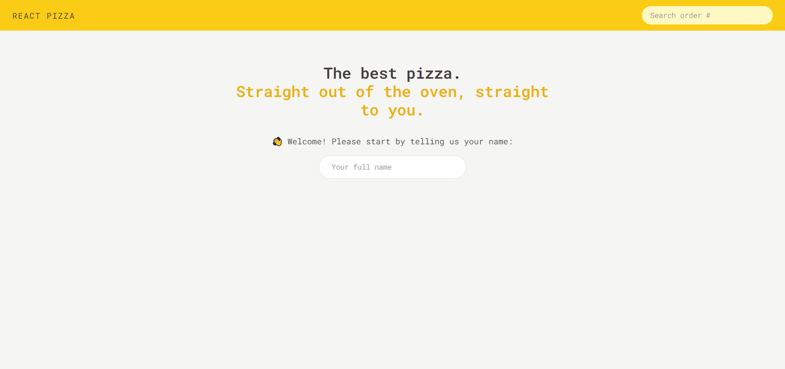
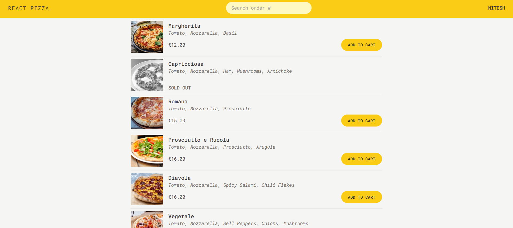
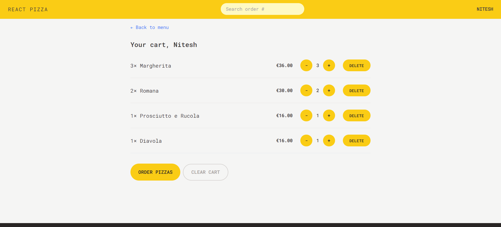
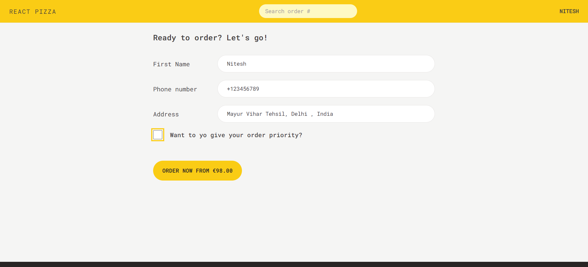
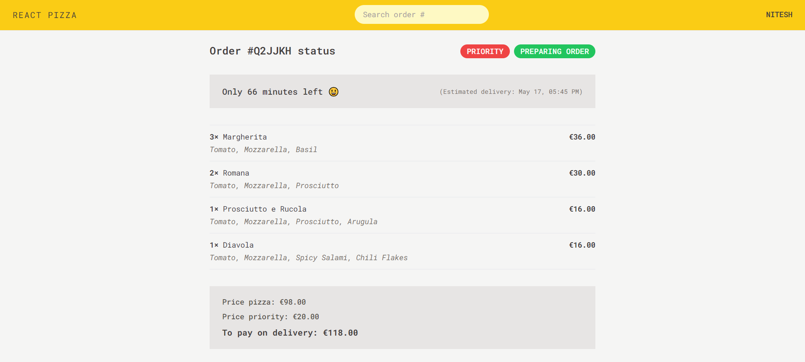

# React-Pizza App

This is an fully responsive app where users can place the order for pizza/s. This app is built using React router v6.4, Redux toolkit and Tailwind.

## Table of contents

- [Overview](#overview)
  - [The challenge](#the-challenge)
  - [Screenshots](#screenshot)
  - [Links](#links)
- [My process](#my-process)
  - [Built with](#built-with)
  - [What I learned](#what-i-learned)
- [Author](#author)
- [Acknowledgments](#acknowledgments)

## Overview

### The challenge

Users should be able to:

- Enter their name which will get reflect to the page later.
- Add different pizza/s with different quantities.
- Delete pizza/s which they don't want from the order.
- Place the order by giving their residence details.
- View the order placed with remaining time.
- View the order by entering the order ID in the search field.

### Screenshots

### Links

- Github URL: [Github Repo](https://github.com/Nitesh-bit/React-pizza)
- Live Site URL: [Project Link](https://reactpizza-1210.netlify.app/)

## My process

### Built with

- Semantic HTML5 markup
- CSS custom properties
- Tailwind
- Fully responsive
- [React](https://reactjs.org/) - JS library
- React Router v6.4
- Redux Toolkit
- Vite with react
- Functional Component
- States and Props
- useState
- Props Drilling
- Controlled components
- Fetching
- Async and Await
- Error handling
- useEffect

### What I learned

Here, I learned more about React-router v6.4 and how we can create different pages. This new version helps in creating data and later loads into the page. Also, we can create actions like Form submission. We can create one Error page and use it at different places with different requirements. I also got to learn about React-Redux and most importantly Redux-toolkit. In the toolkit, we can create a general store where we can put all our reducer functions and use them at different components.

## Author

- Frontend Mentor - [Nitesh Chaudhary](https://www.frontendmentor.io/profile/Nitesh-bit)

## Acknowledgments

I would like to thanks Udemy for continuous learning. And also I would like to thanks ChatGPT and MDN as they helped me to solve mostly all my errors I encountered making this challenge.
